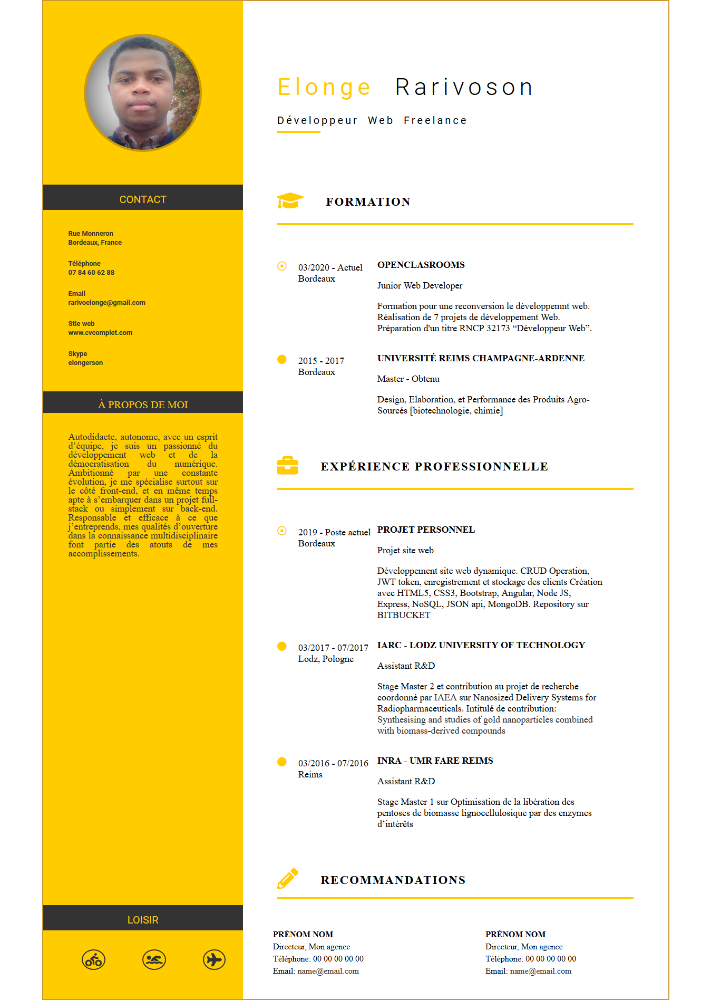

# Bienvenue sur mon page CV sur github
Il s'agit de mon **2em projet sur OPENCLASROOMS**, Job Etudes Nouvelle Aquitaine Développeur Web. J'ai un peu tardé à mettre README, j'ai déjà fait la grande partie du site (HTML et CSS) dans mon appareil local et la première commit a eu lieu hier le 10/04/2020. Je vais l'améliorer selon le premier retour de mon mentor.

## Tâches restantes
* changer l'affichage en responsive mobile
* Farie l'indentation automatique
* Rajouter la balise meta description
* Réduire les codes HTML et CSS 
    * div inutile à enlever
    * réduire les classes dans HTML
* Importer icônes/polices depuis un CDN
* Vérifier HTML et CSS sur le validateur W3C

Cliquer sur mon [site]( https://elonger-12.github.io/p_2_cv_en_siteweb_rarivosonelonge.github.io/) pour le visiter, il est consultable sur différents écrans de taille variée!

## Image du site

